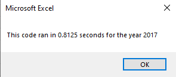
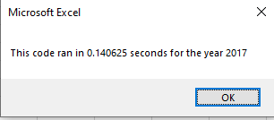
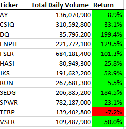
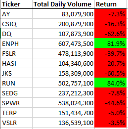

# RBC Module 2 Challenge

## Overview of Project
This project exemplifies a simple refactoring of basic VBA code, so that we loop through all the rows of the sheet once instead of once for each ticker. This refactor should speed up the code significantly since we only see each row once.

## Results of the Refactor
For our results, we look at two pieces of code, first a snippet from the original:
```
'4) Loop through tickers
   For i = 0 To 11
       ticker = tickers(i)
       totalVolume = 0
       '5) loop through rows in the data
       Worksheets(yearValue).Activate
       For j = 2 To RowCount
           '5a) Get total volume for current ticker
           If Cells(j, 1).Value = ticker Then
               totalVolume = totalVolume + Cells(j, 8).Value
           End If
           
           '5b) get starting price for current ticker
           If Cells(j - 1, 1).Value <> ticker And Cells(j, 1).Value = ticker Then
               startingPrice = Cells(j, 6).Value
           End If

           '5c) get ending price for current ticker
           If Cells(j + 1, 1).Value <> ticker And Cells(j, 1).Value = ticker Then
               endingPrice = Cells(j, 6).Value
           End If
       Next j
       '6) Output data for current ticker
       Worksheets("AllStocksAnalysis").Activate
       Cells(4 + i, 1).Value = ticker
       Cells(4 + i, 2).Value = totalVolume
       Cells(4 + i, 3).Value = endingPrice / startingPrice - 1
   Next i
```
And now a snippet from the refactor:
```
''2b) Loop over all the rows in the spreadsheet.
    For j = 2 To RowCount
    
        '3a) Increase volume for current ticker
        If Cells(j, 1).Value = tickers(tickerIndex) Then
               tickerVolumes(tickerIndex) = tickerVolumes(tickerIndex) + Cells(j, 8).Value
        End If
        
        '3b) Check if the current row is the first row with the selected tickerIndex.
        If Cells(j - 1, 1).Value <> tickers(tickerIndex) And Cells(j, 1).Value = tickers(tickerIndex) Then
               tickerStartingPrices(tickerIndex) = Cells(j, 6).Value
        End If
        
        '3c) check if the current row is the last row with the selected ticker
         'If the next row’s ticker doesn’t match, increase the tickerIndex.
        If Cells(j + 1, 1).Value <> tickers(tickerIndex) And Cells(j, 1).Value = tickers(tickerIndex) Then
            tickerEndingPrices(tickerIndex) = Cells(j, 6).Value
        
            '3d Increase the tickerIndex.
            tickerIndex = tickerIndex + 1
        End If
    
    Next j
    
    '4) Loop through your arrays to output the Ticker, Total Daily Volume, and Return.
    For i = 0 To 11
        Worksheets("All Stocks Analysis").Activate
        Cells(4 + i, 1) = tickers(i)
        Cells(4 + i, 2) = tickerVolumes(i)
        Cells(4 + i, 3) = (tickerEndingPrices(i) / tickerStartingPrices(i)) - 1
    Next i
```

As we can see here, the refactor loops over the rowcount as its outer-most loop where as the original loops over the tickers first. This means that we will see each row 12 times (once for each ticker) in the original, but only once in in the refactor.

We can see the difference in computation time, with the original taking 0.8125 seconds as seen here:



and the refactor running in 0.140625 seconds as seen here:



## Analysis of the Stocks
As you can see in the two images below, the stocks in question did much better in 2017 than in 2018 with the exeptions of **Run** and **Terp**.
### Stocks in 2017

### Stocks in 2018


## Summary
In conclusion, refactoring code is valuable for efficiency however, may cost the developer valuable time if the efficient code is not worth the effort. Having a good algorithm in mind on the first attempt will end up saving the developer more time in the long run so as to require less refactoring. 

These ideas apply to this project as well since our initial code took less than a second to run. On a much larger data set this refactor would likely become necessary as hundreds of thousands of trades occur each year. Our refactor cut the execution time by a quarter, but with more tickers and more data points, we would likely see even bigger gains. 
